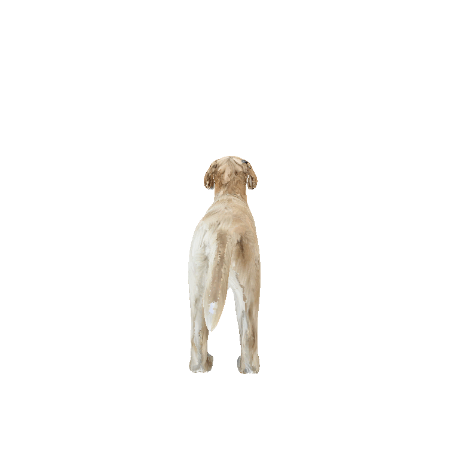

# TexTailor: Customized Text-aligned Texturing via Effective Resampling (ICLR 2025) 

<p align="center"></p>


## Abstract

We present TexTailor, a novel method for generating consistent object textures from textual descriptions. Existing text-to-texture synthesis approaches utilize depth-aware diffusion models to progressively generate images and synthesize textures across predefined multiple viewpoints. However, these approaches lead to a gradual shift in texture properties across viewpoints due to (1) insufficient integration of previously synthesized textures at each viewpoint during the diffusion process and (2) the autoregressive nature of the texture synthesis process. Moreover, the predefined selection of camera positions, which does not account for the object's geometry, limits the effective use of texture information synthesized from different viewpoints, ultimately degrading overall texture consistency. In TexTailor, we address these issues by (1) applying a resampling scheme that repeatedly integrates information from previously synthesized textures within the diffusion process, and (2) fine-tuning a depth-aware diffusion model on these resampled textures. During this process, we observed that using only a few training images restricts the model's original ability to generate high-fidelity images aligned with the conditioning, and therefore propose an performance preservation loss to mitigate this issue. Additionally, we improve the synthesis of view-consistent textures by adaptively adjusting camera positions based on the object's geometry. Experiments on a subset of the Objaverse dataset and the ShapeNet car dataset demonstrate that TexTailor outperforms state-of-the-art methods in synthesizing view-consistent textures.

>For additional details, please refer to the following paper: 

> [TexTailor: Customized Text-aligned Texturing via Effective Resampling (ICLR 2025)](https://openreview.net/pdf?id=1NprT9Kz0d)

>[SuinLee](https://adios42.github.io/) and Dae-Shik Kim from KAIST

## Setup

The code is tested on Ubuntu 18.04.6 LTS with PyTorch 1.12.1 CUDA 11.3 installed. Please follow the following steps to install PyTorch first. To run our method, you should at least have a NVIDIA GPU with 24 GB RAM (NVIDIA GeForce TITAN RTX works for us).

```shell
# create and activate the conda environment
conda create -n textailor python=3.9.15
conda activate textailor

# install PyTorch 2.1.0
conda install pytorch==2.1.0 torchvision==0.16.0 torchaudio==2.1.0 pytorch-cuda=11.8 -c pytorch -c nvidia
```

Then, install PyTorch3D:

```shell
# install runtime dependencies for PyTorch3D
conda install -c fvcore -c iopath -c conda-forge fvcore iopath

# install PyTorch3D
pip install "git+https://github.com/facebookresearch/pytorch3d.git"
```

Install `xformers` to accelerate transformers:

```shell
# please don't use pip to install it, as it only supports PyTorch>=2.0
conda install xformers -c xformers
```

Install the necessary packages listed out in requirements.txt:

```shell
pip install -r requirements.txt
```

To use the ControlNet Depth2img model, please download `control_v11f1p_sd15_depth.pth` from the [hugging face page](https://huggingface.co/lllyasviel/ControlNet-v1-1/tree/main), and download Stable Diffusion 1.5 model(v1-5-pruned.ckpt) from the [hugging face page](https://huggingface.co/stable-diffusion-v1-5/stable-diffusion-v1-5/tree/main) and put them under `models/ControlNet/models/`.

## Dataset
### 1. Objaverse subset
To generate textures for the Objaverse objects we used in the paper, please run the following script to download and pre-process those meshes:

```shell
python scripts/download_objaverse_subset.py
```

All pre-processed meshes will be downloaded to `data/objaverse/`.
### 2. Renderpeople 
In the appendix of the paper, TexTailor synthesizes textures for human meshes using four free models from [Renderpeople](https://renderpeople.com/?srsltid=AfmBOoozvp_2WyPLNX_p2Xvp3eaXzI3LraQb-nlmSwRylFE5poCTO3CZ) .

## Demo
### 1. Our results
#### Objects
<div align="center">

| **Item** | **Description** |**Texture** |
|:-:|:---:|:----------:|
| 🐶 Dog | a golden retriever ||
| 🧁 Cupcake | a chocolate cupcake with chocolate frosting in a dark paper liner ||
| 🚗 Minivan | a blue minivan ||
</div>

#### Humans
| **Item** | **Description** |**Texture** |
|:-:|:---:|:----------:|
| claudia | a woman wearing a white blouse with a ribbon detail, light beige pants, nude-tone heels, and neatly tied blonde hair ||
|  eric | a man, wearing  a black vest, black formal trousers, a black tie, a black belt, a white dress shirt, and dark formal shoes, with short neatly styled hair ||
| carla | a woman with dark skin tone, wearing a black blazer, a black top, gray pants with a gray tied belt, black heels, and having dark hair ||


### 2. Try the Demo (Sanity check)

To ensure everything is set up and configured correctly, run the following script to generate textures for an object (Dog, Cupcake, Pickup Truck) or a human (Claudia, Eric, Carla).

```shell
bash ./bash/run_{object_name or human name}.sh
```

Once the synthesis is complete, all generated assets and trained model parameters will be stored in:
* For objects: 
`outputs/{object_name}/42-p36-h30-1.0-0.3-0.2`

* For humans:
`outputs/{human_name}/42-p36-h30-1.0-0.3-0.2` 

To load the final mesh, use the following paths:
* For objects: `outputs/{object_name}/42-p36-h30-1.0-0.3-0.2/update/mesh/29_post.obj`

* For humans: `outputs/{human_name}/42-p36-h30-1.0-0.3-0.2/update_face/mesh/12_post.obj`

To generate the results in GIF format, run the following command:

```shell
python scripts/generate_gif.py \
    --input_dir GIF/<run-name> \
    --obj_path <path-to-textured-mesh-file>  \
    --num_views <number-of-frames>\
```


## Try your own mesh

For the best quality of texture synthesis, there are some necessary pre-processing steps for running our method on your own mesh:

1) Y-axis is up.
2) The mesh should face towards +Z.
3) The mesh's bounding box should be origin-aligned (note that simply averaging the vertex coordinates could be problematic).
4) The max length of the mesh bounding box should be around 

We provide `scripts/normalize_mesh.py` and `scripts/rotate_mesh.py` to make the mesh preprocessing easy for you.

> NOTE: We expect the mesh to be triangulated.

A mesh that is ready for the next steps should look like this:

<p align="center"></p>

Then, you can generate your own texture via:
### 1. Objects

```shell
python scripts/generate_texture.py \
    --input_dir <path-to-mesh> \
    --output_dir outputs/<run-name> \
    --obj_name <mesh-name> \
    --obj_file <mesh-name>.obj \
    --prompt <your-prompt> \
    --add_view_to_prompt \
    --ddim_steps 30 \
    --new_strength 1.0 \
    --update_strength 0.3 \
    --view_threshold 0.2 \
    --blend 0 \
    --dist 1 \
    --num_viewpoints 36 \
    --viewpoint_mode predefined \
    --use_principle \
    --update_steps 30 \
    --update_mode heuristic \
    --seed 42 \
    --post_process \
    --device "2080" \
    --resampling 3  \
    --training      \
    --use_patch     \
    --flexible_view    \
    --use_objaverse     \
    --num_images 3   
    # assume the mesh is normalized with y-axis as up
```

### 2. Humans
For human meshes, it is recommended to run an additional update specifically for the face using the `--use_face` flag to enhance facial details. You can adjust the position of the facial part using the `--dist_face` and `--face_offset` flags.
```shell
python scripts/generate_texture.py \
    --input_dir <path-to-mesh> \
    --output_dir outputs/<run-name> \
    --obj_name <mesh-name> \
    --obj_file <mesh-name>.obj \
    --prompt <your-prompt> \
    --add_view_to_prompt \
    --ddim_steps 30 \
    --new_strength 1.0 \
    --update_strength 0.3 \
    --view_threshold 0.2 \
    --blend 0 \
    --dist 0.7 \
    --num_viewpoints 36 \
    --viewpoint_mode predefined \
    --use_principle \
    --update_steps 30 \
    --update_mode heuristic \
    --seed 42 \
    --post_process \
    --device "2080" \
    --resampling 3  \
    --training      \
    --use_patch     \
    --flexible_view    \
    --pre_view 12      \
    --num_images 3   \
    --use_face      \
    --face_offset [0.0,-0.4,0.0] \
    --dist_face 0.15
    # assume the mesh is normalized with y-axis as up
```

If you want high-res textures, set `--device` to `a6000` for 3k resolution. To play around other parameters, please check `scripts/generate_texture.py`, or simply run `python scripts/generate_texture.py -h`.

## Citation
```shell
@inproceedings{leetextailor,
  title={TexTailor: Customized Text-aligned Texturing via Effective Resampling},
  author={Lee, Suin and Kim, Daeshik},
  booktitle={The Thirteenth International Conference on Learning Representations}
}
```

## Acknowledgement

We would like to express our gratitude to [lllyasviel/ControlNet](https://github.com/lllyasviel/ControlNet) and [daveredrum/Text2Tex](https://github.com/daveredrum/Text2Tex) for providing such powerful and invaluable codebases for diffusion models and texture synthesis. This code is based on [daveredrum/Text2Tex](https://github.com/daveredrum/Text2Tex)

